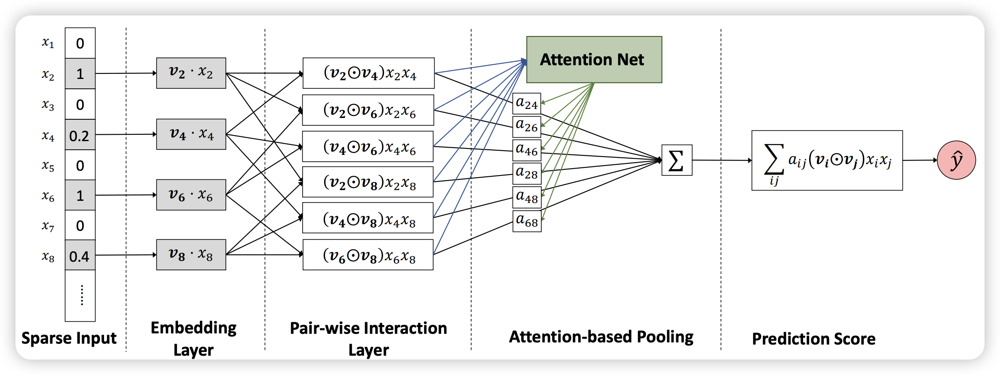
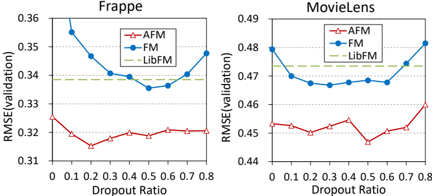
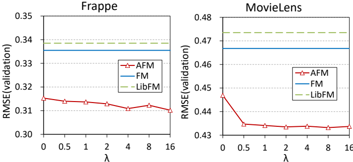
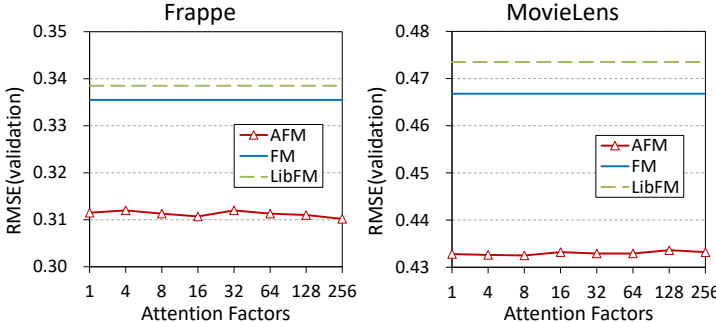
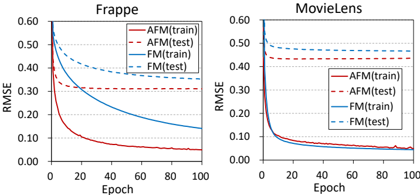

# Attentional Factorization Machines: Learning the Weight of Feature Interactions via Attention Networks∗

https://arxiv.org/pdf/1708.04617

# 研究背景

1. **研究问题**：这篇文章要解决的问题是传统因子机（Factorization Machines, FM）在处理特征交互时，对所有特征交互赋予相同权重，导致模型性能受限。具体来说，FM无法有效区分有用和无用特征之间的交互，可能会引入噪声，降低预测性能。
2. **研究难点**：该问题的研究难点包括：如何有效区分不同特征交互的重要性，如何在建模过程中自动学习特征交互的权重，以及如何在保证模型性能的同时减少模型复杂度。
3. **相关工作**：FM已经被广泛应用于推荐系统、在线广告和图像识别等领域。然而，FM在处理稀疏数据时存在泛化问题。现有的解决方案如多项式回归和宽深模型（Wide&Deep）虽然能够捕捉特征交互，但存在参数估计问题和模型可解释性差的问题。

## 研究方法

**这篇论文提出了一种名为注意力因子机（Attentional Factorization Machine, AFM）的新模型，用于解决FM在处理特征交互时存在的权重分配不均问题。具体来说，AFM通过神经网络中的注意力机制来学习每个特征交互的重要性。**

1. **模型架构**：AFM的神经网络架构包括输入层、嵌入层、成对交互层和基于注意力的池化层。输入层和嵌入层与FM相同，将非零特征嵌入到密集向量中。成对交互层通过元素级乘积扩展特征向量，形成交互向量。基于注意力的池化层通过对交互向量进行加权求和，计算每个特征交互的重要性得分。

2. **成对交互层**：成对交互层的输出表示为：

   $$
   f_{P I}(\mathcal{E})=\left\{\left(v_i\odot v_j\right) x_i x_j\right\}_{(i, j)\in\mathcal{R}_x}
   $$
   其中，$\odot$ 表示两个向量的元素级乘积，$\mathcal{R}_x=\{ (i,j) \}_{i\in \mathcal{X}, j\in \mathcal{X}, j>i}$表示所有可能的特征对。
3. **基于注意力的池化层**：注意力机制通过对交互向量进行加权求和，计算每个特征交互的重要性得分：
   $$
   f_{\text{Att}}(f_{PI}(\mathcal{E}))=\sum_{(i,j)\in \mathcal{R}_x}a_ij(v_i\odot v_j)x_i x_j
   $$

   其中，$a_{ij}$ 是特征交互 $\hat{w}_{i,j}$ 的注意力得分，通过多层感知器（MLP）估计：
   $$
   a'_{ij}=h^T \text{ReLU}(W(v_i\odot v_j)x_i x_j+b)
   $$

   $$
   a_{ij}=\frac{\exp(a'_{ij})}{\sum_{(i,j)\in \mathcal{R}_x}\exp(a'_{ij})}
   $$

   其中，$W\in \mathbb{R}^{t\times k}$, $b\in\mathbb{R}^{t}$, $h\in \mathbb{R}^t$是模型参数，$t$ 表示注意力网络的隐藏层大小。
4. **目标函数与优化**：AFM的目标函数为平方损失：
    $$
    L_r = \sum_{x\in \tau} (\hat{y}_{AFM}(x)-y(x))^2
    $$
    
    其中，$\tau$ 表示训练实例集合。使用随机梯度下降（SGD）优化目标函数，并应用$L_2$正则化和dropout防止过拟合。

## 实验设计

1. **数据集**：实验使用了两个公开数据集：Frappe和MovieLens2。Frappe数据集用于上下文感知的推荐，包含96,203条用户应用日志，转换为5,382个特征。MovieLens数据集用于个性化标签推荐，包含668,953条用户对电影的标签申请，转换为90,445个特征。
2. **评估协议**：每个日志被赋予一个目标值1，表示用户在给定上下文中使用了应用或在电影上应用了标签。随机配对两个负样本，目标值为-1。最终实验数据包含288,609条（Frappe）和2,006,859条（MovieLens）实例。数据集随机分为训练集（70%）、验证集（20%）和测试集（10%）。性能通过均方根误差（RMSE）评估，RMSE越低表示性能越好。
3. **基线方法**：比较了AFM与以下几种竞争方法：LibFM、HOFM、Wide&Deep和DeepCross。所有方法均通过优化平方损失进行学习，使用Mini-batch Adagrad优化算法。

## 结果与分析

1. **超参数影响**：
   * **Dropout**：适当的dropout比率可以显著提高AFM和FM的性能。对于Frappe和MovieLens数据集，最佳dropout比率分别为0.2和0.5。
    
        

   * **正则化**：对注意力网络施加L2*L*2正则化可以进一步提高AFM的性能。当λ*λ*大于0时，AFM的性能得到改善。
    
     
1. **注意力网络的影响**：
   * **注意力因子**：AFM在不同注意力因子下的性能相对稳定。即使注意力因子为1，AFM仍显著优于FM。
     
   * **收敛速度**：AFM比FM收敛更快，且在测试集上的误差更低，表明AFM具有更好的泛化能力。
     
2. **微观层面分析**：通过分析MovieLens数据集中的特征交互得分，发现AFM能够有效区分不同特征交互的重要性，从而提高预测准确性。
3. **性能比较**：AFM在所有方法中表现最佳，相对于LibFM有8.6%的相对提升，且使用的模型参数更少。AFM在性能上优于Wide&Deep和DeepCross，同时保持了更简单的结构和较少的参数。

## 总体结论

**本文提出的注意力因子机（AFM）通过引入注意力机制，改进了传统因子机（FM）在处理特征交互时的权重分配问题。AFM不仅提高了模型的表示能力和预测准确性，还增强了模型的可解释性。未来的研究方向包括探索AFM的深度版本、提高学习效率以及将其应用于其他类型的数据和任务。**

# 论文评价

## 优点与创新

1. **提出了注意力机制**：论文通过引入注意力网络来学习特征交互的重要性，从而改进了传统的因子分解机（FM）。这种方法能够自动从数据中学习特征交互的重要性，无需人工领域知识。
2. **提高模型性能**：实验结果表明，AFM在回归任务上比FM有8.6%的相对提升，并且在结构更简单、参数更少的情况下，一致性地优于最先进的深度学习方法（如Wide&Deep和DeepCross）。
3. **增强模型解释性**：AFM通过注意力分数为每个特征交互赋予不同的权重，增强了模型的可解释性和透明度，使得实践者能够对模型的行为进行更深入的分析。
4. **防止过拟合**：论文采用了dropout和L2*L*2正则化两种技术来防止过拟合，特别是针对AFM中可能出现的过拟合问题，提出了有效的解决方案。
5. **广泛适用性**：AFM不仅适用于稀疏数据的预测，还可以应用于回归、分类和排序等多种预测任务。

## 不足与反思

1. **未来工作方向**：论文提到未来的研究方向包括探索AFM的深度版本，通过堆叠多个非线性层来进一步提升性能；考虑使用学习哈希和数据采样技术来提高AFM的学习效率；开发适用于半监督和多视图学习的FM变体；以及在文本问答和更丰富的多媒体内容建模等领域探索AFM的应用。

# 关键问题及回答

**问题1：AFM模型中的Pair-wise Interaction Layer是如何替代FM中的内积操作的？**

**AFM模型中的Pair-wise Interaction Layer通过将每个特征向量扩展为与其他特征向量的元素乘积来替代FM中的内积操作。具体来说，Pair-wise Interaction Layer的输出表示为：**

$$
   f_{P I}(\mathcal{E})=\left\{\left(v_i\odot v_j\right) x_i x_j\right\}_{(i, j)\in\mathcal{R}_x}
$$

其中，$\odot$ 表示两个向量的元素级乘积，$\mathcal{R}_x=\{ (i,j) \}_{i\in \mathcal{X}, j\in \mathcal{X}, j>i}$表示所有可能的特征对。这种方法能够更有效地编码特征之间的交互信息，而不仅仅是通过内积操作。

**问题2：AFM模型中的注意力机制是如何工作的？它是如何提高模型性能的？**

**AFM模型中的注意力机制通过对特征交互进行加权求和来工作。具体来说，注意力分数通过一个多层感知器（MLP）估计，公式如下：**

   $$
   a'_{ij}=h^T \text{ReLU}(W(v_i\odot v_j)x_i x_j+b)
   $$

   $$
   a_{ij}=\frac{\exp(a'_{ij})}{\sum_{(i,j)\in \mathcal{R}_x}\exp(a'_{ij})}
   $$

其中，$W$ 是权重矩阵，$b$ 是偏置项，$h$ 是隐藏层的输入，$a_{ij}$ 是特征交互的注意力分数。通过这种方式，AFM能够自动学习不同特征交互的重要性，并对它们进行加权求和，从而提高模型的预测性能。实验结果表明，注意力机制不仅提高了模型的性能，还增强了模型的可解释性。

**问题3：AFM模型在实验中的表现如何？与其他基线方法相比有何优势？**

**AFM模型在实验中表现出色，特别是在模型参数较少的情况下，AFM比FM有8.6\%的相对改进，比Wide&Deep有4.3\%的相对改进。具体来说，AFM在Frappe和MovieLens数据集上的验证误差分别达到了0.3102和0.4325，显著优于其他基线方法，如LibFM、HOFM、Wide&Deep和DeepCross。此外，AFM还表现出更好的泛化能力，测试误差普遍低于训练误差，表明其能够更好地适应未见数据。总体而言，AFM不仅在性能上优于现有方法，还在模型参数较少的情况下实现了更高的性能，展示了其在稀疏数据预测任务中的潜力。**
