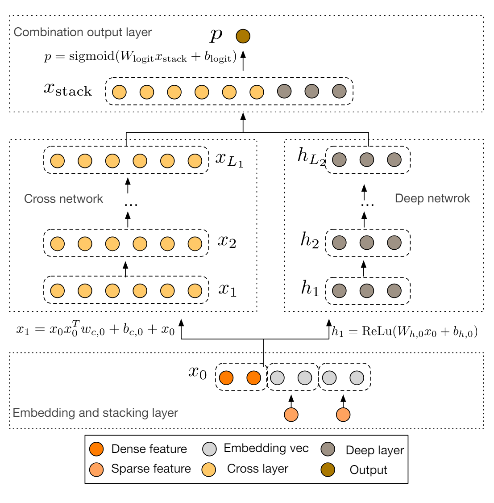
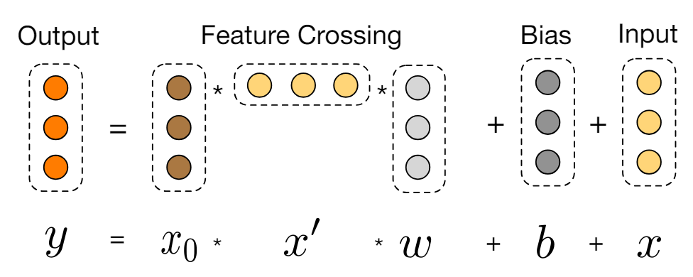
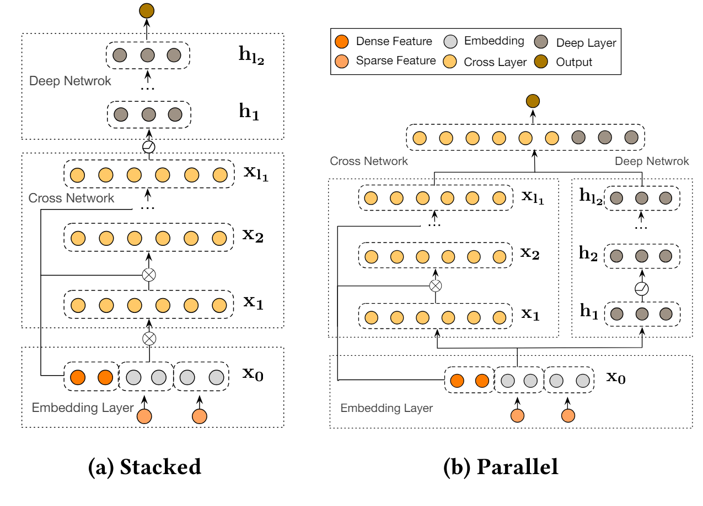
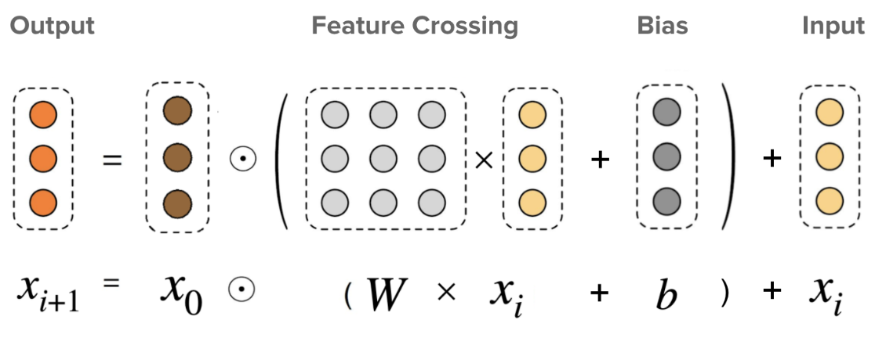

# DCN v1 & v2

## DCN v1
公司：谷歌
《Deep & Cross Network for Ad Click Predictions》这篇论文提出了一种新的神经网络架构，即深度与交叉网络（Deep & Cross Network，简称DCN），旨在有效地学习特征交叉以提高广告点击率（CTR）预测的性能。这篇论文的主要贡献和特点如下：

### 主要贡献

1. **深度与交叉网络（DCN）**：DCN通过一个交叉网络（Cross Network）和一个深度网络（Deep Network）的结合来学习特征的显式和隐式交叉。交叉网络负责模型特征之间的显式交叉，而深度网络则负责学习特征的隐式交叉和非线性组合。

2. **高效学习特征交叉**：DCN的核心在于其交叉网络部分，该部分通过一系列交叉层来有效地学习特征之间的交叉。这种方式相比于传统的多项式展开或深度网络中的隐式学习，可以更直接且高效地捕捉特征交叉。

3. **简单且易于实现**：DCN不仅性能强大，而且架构相对简单，易于实现和集成到现有的CTR预测模型中。

### 网络架构

DCN主要由两部分组成：

- **交叉网络（Cross Network）**：负责显式地模拟特征交叉。它由多个交叉层组成，每个交叉层都在前一层的基础上增加一个特征交叉，从而能够捕捉到不同层级的特征交叉信息。

$$
\mathbf{x}_{l+1}= \mathbf{x}_0\mathbf{x}_{l}^T \mathbf{x}_{l+1}\mathbf{w}_{l} + \mathbf{b}_{l} + \mathbf{x}_{l} = f(\mathbf{x}_{l}, \mathbf{w}_{l}, \mathbf{b}_{l}) + \mathbf{x}_{l}.
$$

- **深度网络（Deep Network）**：是一个典型的前馈神经网络，负责学习特征的隐式交叉和非线性组合。深度网络可以捕捉到复杂的非线性关系，增强模型的表达能力。

## DCN v2
公司：谷歌
DCN V2: Improved Deep & Cross Network and Practical Lessons for Web-scale Learning to Rank Systems

