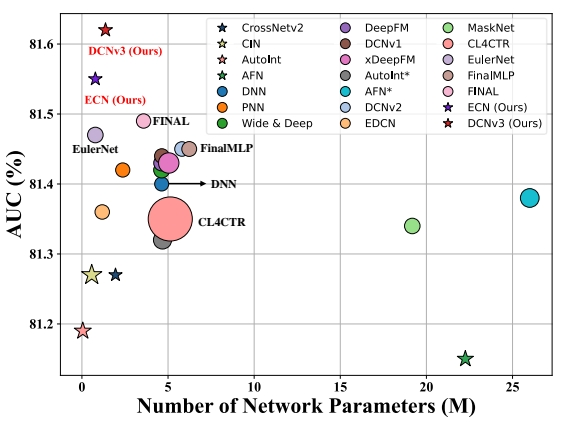

#  核心速览

## 研究背景

1. **研究问题**：这篇文章要解决的问题是点击率（CTR）预测中的特征交互建模。具体来说，现有的深度交叉网络（DCN）及其衍生模型在计算成本和性能之间取得了有效平衡，但存在四个主要局限性：显式特征交互方法的性能通常弱于隐式深度神经网络（DNN）；许多模型在增加特征交互阶数时未能有效过滤噪声；大多数模型的融合方法无法为其不同子网络提供适当的监督信号；尽管大多数模型声称能够捕捉高阶特征交互，但它们通常通过DNN隐式且不可解释地实现这一点，这限制了模型预测的可信度。

2. **研究难点**：该问题的研究难点包括：如何在不使用DNN的情况下提高显式特征交互的性能；如何在增加特征交互阶数的同时有效过滤噪声；如何为不同子网络提供适当的监督信号；如何提高模型的可解释性。

3. **相关工作**：该问题的研究相关工作有：传统的线性模型如LR和FM，以及深度学习模型如DNN、PNN、Wide & Deep、DeepFM、DCNv1、DCNv2、DIN、FiGNN等。这些模型在捕捉特征交互方面有不同的方法和优缺点。
    
## 研究方法

这篇论文提出了下一代深度交叉网络（DCNv3），用于解决CTR预测中的特征交互建模问题。具体来说，

1. **线性交叉网络（LCN）**：用于低阶（浅层）显式特征交互，采用线性增长的交互方法。其递归公式如下：
    $$
    \mathbf{c}_l = \mathbf{W}_l \mathbf{x}_l + \mathbf{b}_l,
    $$

    $$
    \mathbf{x}_{l+1} = \mathbf{x}_{l} \odot[\mathbf{c}_{l} || \text{Mask}(\mathbf{c}_{l})] +\mathbf{x}_{l},
    $$
    其中，$c_l\in\mathbb{R}^{D//2}$表示第$l$层的交叉向量，$\mathbf{W}_l\in\mathbb{R}^{\frac{D}{2}\times D}$ 和 $\mathbf{b}_{l}\in\mathbb{R}^{\frac{D}{2}}$分别是可学习的权重矩阵和偏置向量，$\mathbf{x}_{l+1}$是第 $l+1$ 层的特征交互，$\text{Mask}$表示自掩码操作。

2. **指数交叉网络（ECN）**：用于高阶（深层）显式特征交互，采用指数增长的交互方法。其递归公式如下：

    $$
    \mathbf{c}_l = \mathbf{W}_l \mathbf{x}_{2^{l-1}} + \mathbf{b}_l,
    $$

    $$
    \mathbf{x}_{2^{l}} = \mathbf{x}_{2^{l-1}} \odot[\mathbf{c}_{l} || \text{Mask}(\mathbf{c}_{l})] +\mathbf{x}_{2^{l-1}},
    $$

    其中，$\mathbf{x}_{2^{l}}$表示第$2^{l}$阶的交叉向量。

3. **自掩码操作（Self-Mask）**：用于过滤噪声并减少交叉网络中的参数数量。其计算过程如下：
    $$
    \text{Mask}(\mathbf{c}_l)=\mathbf{c}_l\odot\max(0, \text{LN}(\mathbf{c}_l)),
    $$

    $$
    \text{LN}(\mathbf{c}_l)=\mathbf{g}\odot \frac{\mathbf{c}_l -\mu}{\delta}+\mathbf{b},
    $$
    其中，LNLN表示层归一化，$\mathbf{g}$和$\mathbf{b}$是参数。

4. **融合层**：通过LCN和ECN的预测结果进行融合：两个term的预测结果进行分别经过一个线性层，得到$\hat{y}_D$和$\hat{y}_S$，最终求均值得到预测结果$\hat{y}$。

5. **Tri-BCE损失**：提出了一种简单而有效的多损失计算方法，称为Tri-BCE，以提供适当的监督信号：$\hat{y}_D$, $\hat{y}_S$, $\hat{y}$ 均与真实标签计算交叉熵损失，然后加权求和。

## 实验设计

1. **数据集**：在六个CTR预测数据集上进行实验，包括Avazu、Criteo、ML-1M、KDD12、iPinYou和KKBox。
2. **数据预处理**：对数据进行预处理，包括时间戳字段的转换、数值特征字段的离散化处理以及不常见分类特征的替换。
3. **评估指标**：使用Logloss和AUC两个常用指标来比较模型性能。AUC衡量正例排在负例之前的概率，Logloss衡量模型拟合数据的能力。
4. **基线模型**：与一些最先进的模型进行比较，包括仅显式特征交互的模型和集成隐式特征交互的模型。
5. **实现细节**：使用PyTorch实现所有模型，采用Adam优化器，设置默认学习率为0.001，嵌入维度根据数据集不同而有所不同，批量大小根据数据集不同而有所不同，使用早停法防止过拟合。

## 结果与分析

1. **整体性能（RQ1）**：DCNv3在所有六个数据集上均表现出色，平均AUC提升0.21%，平均Logloss降低0.11%，均超过统计显著阈值0.1%。ECN在AUC方面表现最佳，而DCNv3在Logloss优化方面表现更好。

    

2. **效率比较（RQ2）**：显式CTR模型通常参数较少，运行时间较短。DCNv3和ECN是最参数高效的模型，分别在Avazu和Criteo数据集上达到SOTA性能，同时保持较高的运行效率。

    

3. **可解释性和噪声过滤能力（RQ3）**：通过动态交叉向量和静态权重向量分析了模型的预测过程，发现自掩码操作有效地过滤了噪声，提高了模型的可解释性。

    

4. **消融研究（RQ4）**：去除Tri-BCE损失、去除层归一化后的模型性能有所下降，表明这些组件对模型性能的必要性。LCN和ECN在不同网络深度下的性能也进行了实验，发现ECN在高阶特征交互方面表现更优。

    

## 总体结论

本文提出了DCNv3，一种新的显式特征交互建模方法，通过LCN和ECN分别捕捉低阶和高阶特征交互，并使用自掩码操作过滤噪声。Tri-BCE损失为不同子网络提供了适当的监督信号。实验结果表明，DCNv3在多个CTR基准测试中取得了第一名的成绩，打破了传统CTR模型集成隐式特征交互以提高性能的惯例。

# 论文评价

## 优点与创新

1. **首次实现仅使用显式特征交互建模**：本文首次在不集成DNN的情况下实现了令人惊讶的性能，这可能颠覆了以往CTR预测文献中的范式，激发了进一步重新审视和创新特征交互建模的潜力。
2. **引入新的深度交叉方法**：提出了一种新的指数增长的深度交叉方法，称为Deep Crossing，以显式捕捉高阶特征交互，同时将之前的交叉方法归类为浅层交叉。
3. **自掩码操作**：设计了一种自掩码操作来过滤噪声并减少交叉网络中的参数数量，使其减半。
4. **多损失计算方法**：在融合层中，提出了一种简单而有效的多损失计算和权衡方法，称为Tri-BCE，以确保不同子网络获得适当的监督信号。
5. **实验验证**：在六个数据集上的综合实验验证了DCNv3的有效性、效率和可解释性。基于实验结果，模型在多个CTR预测基准测试中获得了第一名。

## 不足与反思

1. **模型复杂度分析**：尽管本文提出的ECN和DCNv3在参数效率和运行时间上表现出色，但由于使用了Tri-BCE损失，DCNv3的损失计算时间复杂度是其他模型的三倍，这可能会影响实际应用中的推理速度。
2. **下一步工作**：未来的研究可以进一步优化模型的计算效率，例如通过改进损失函数的计算方式或引入更高效的优化算法来减少训练时间。

# 关键问题及回答

**问题1：DCNv3中的线性交叉网络（LCN）和指数交叉网络（ECN）在特征交互方法上有何不同？它们分别适用于什么样的特征交互场景？**

线性交叉网络（LCN）用于低阶（浅层）显式特征交互，采用线性增长的交互方法。其递归公式如下：

$$
\mathbf{c}_l = \mathbf{W}_l \mathbf{x}_l + \mathbf{b}_l,
$$

$$
\mathbf{x}_{l+1} = \mathbf{x}_{l} \odot[\mathbf{c}_{l} || \text{Mask}(\mathbf{c}_{l})] +\mathbf{x}_{l},
$$

LCN适用于捕捉低阶特征交互，能够在有限层数内有效地进行特征交互，适合用于小规模或中等规模的数据集。

指数交叉网络（ECN）用于高阶（深层）显式特征交互，采用指数增长的交互方法。其递归公式如下：

$$
\mathbf{c}_l = \mathbf{W}_l \mathbf{x}_{2^{l-1}} + \mathbf{b}_l,
$$

$$
\mathbf{x}_{2^{l}} = \mathbf{x}_{2^{l-1}} \odot[\mathbf{c}_{l} || \text{Mask}(\mathbf{c}_{l})] +\mathbf{x}_{2^{l-1}},
$$

ECN适用于捕捉高阶特征交互，能够在较少的层数内实现特征交互的指数增长，适合用于大规模数据集和需要高效特征交互的场景。

**问题2：DCNv3中的自掩码操作（Self-Mask）是如何工作的？它在特征交互过程中起到了什么作用？**

自掩码操作（Self-Mask）用于过滤噪声并减少交叉网络中的参数数量。其计算过程如下：

$$
\text{Mask}(\mathbf{c}_l)=\mathbf{c}_l\odot\max(0, \text{LN}(\mathbf{c}_l)),
$$

$$
\text{LN}(\mathbf{c}_l)=\mathbf{g}\odot \frac{\mathbf{c}_l -\mu}{\delta}+\mathbf{b},
$$
其中，$\text{LN}$表示层归一化，$\mathbf{g}$和$\mathbf{b}$是参数。

在特征交互过程中，自掩码操作通过将交叉向量的每个元素与层归一化后的结果进行逐元素乘积，从而过滤掉噪声信息。具体来说，层归一化确保了掩码操作后交叉向量中包含大约50%的零值，这些零值对应于无用的噪声特征交互，从而减少了模型的参数数量和计算复杂度，同时提高了模型的泛化能力和预测精度。

**问题3：DCNv3中的Tri-BCE损失函数是如何设计的？它如何为不同子网络提供适当的监督信号？**

Tri-BCE损失函数用于提供适当的监督信号。其计算过程如下：
$$
\mathcal{L}_{\text{Tri}}=\mathcal{L}+\mathbf{w}_D \cdot \mathcal{L}_D+\mathbf{w}_s \cdot \mathcal{L}_s, 
$$

其中，$\mathbf{w}_D=\max(0,\mathcal{L}_D -\mathcal{D})$ 和 $\mathbf{w}_s=\max(0,\mathcal{L}_s -\mathcal{L})$ 是自适应权重。

Tri-BCE损失函数通过为ECN和LCN分别设置自适应权重$\mathbf{w}_D$和$\mathbf{w}_s$，使得这两个子网络在训练过程中获得不同的监督信号。具体来说，Tri-BCE损失函数的主要损失$\mathcal{L}$是二元交叉熵损失，辅助损失$\mathcal{L}_D$和$\mathcal{L}_s$分别针对ECN和LCN的预测结果。通过联合训练这两个子网络，Tri-BCE损失函数能够动态调整权重，确保每个子网络根据其在总体损失中的贡献获得合适的监督信号，从而提高模型的整体性能。