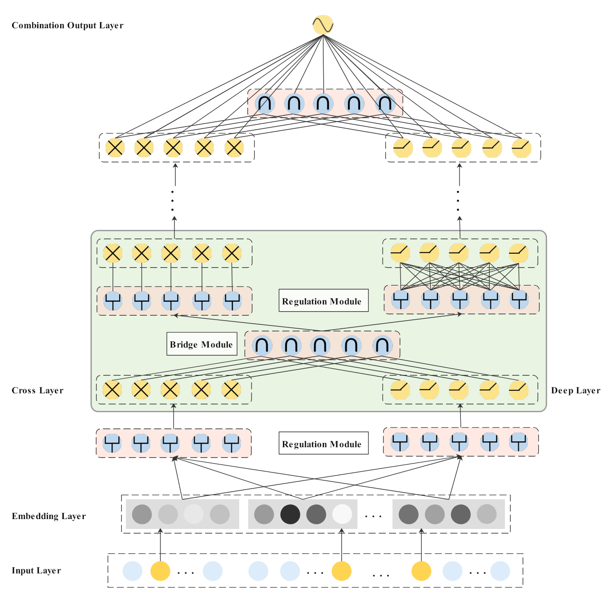

# Enhancing Explicit and Implicit Feature Interactions via Information Sharing for Parallel Deep CTR Models

公司：华为

## 模型结构

### Bridge Module

每一对深度网络的特征$\mathbf{x}_l$和交叉网络的特征$\mathbf{h}_l$都会进行信息共享，共有四种方式

- 加法：$ \mathbf{f}_l= \mathbf{x}_l  + \mathbf{h}_l$
- 逐元素乘积：$ \mathbf{f}_l= \mathbf{x}_l  \circ \mathbf{h}_l$
- 拼接：$ \mathbf{f}_l= \text{ReLU}(\mathbf{W}_l^T \text{concat}(\mathbf{x}_l, \mathbf{h}_l) + \mathbf{b}_l)  $
- 注意力池化：
$$
\mathbf{f}_l = a_{l}^x \oplus \mathbf{h}_l,\
a_{l}^x=\text{softmax}(\mathbf{p}_l^T \text{ReLU}(\mathbf{w}_l^T \mathbf{x}_l + \mathbf{b}_l)) )
$$

根据实验结果，逐元素乘积的效果最佳。