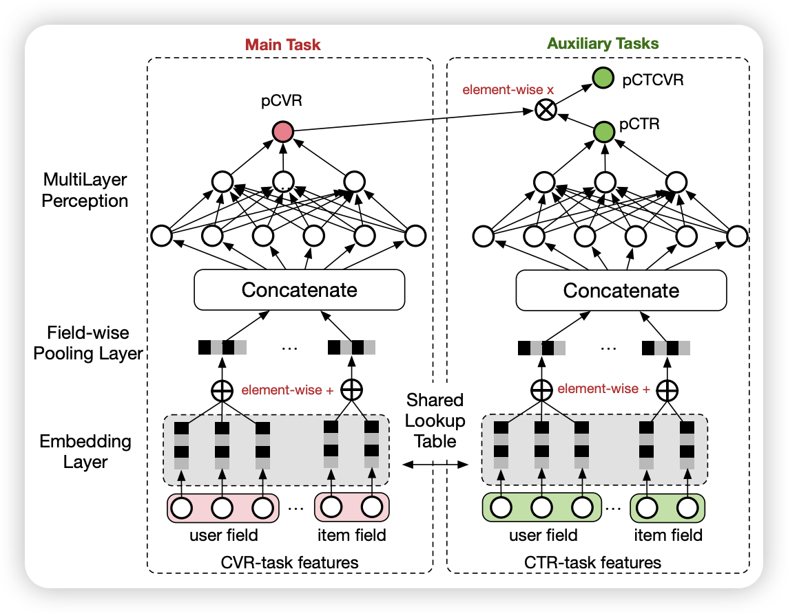

# Entire Space Multi-Task Model: An Effective Approach for Estimating Post-Click Conversion Rate

公司：阿里巴巴

核心思想：通过预估 ctcvr 代替 间接预估cvr

核心公式：

$$
pCTCVR=pCVR\times pCTR
$$

构建真实标签，正常的数据存在如下的真实标签组合

| 列名 | 曝光 | 点击 | 转化 |
| ---- | ---- | ---- | ---- |
| a    | 0    | 0    | 0    |
| b    | 1    | 0    | 0    |
| c    | 1    | 1    | 0    |
| d    | 1    | 1    | 1    |

对于预估点击率的任务，曝光后点击的样本为正样本，如 c,d

对于预估 ctcvr，仅 d 为正样本，其他均为负样本。

## 模型结构

