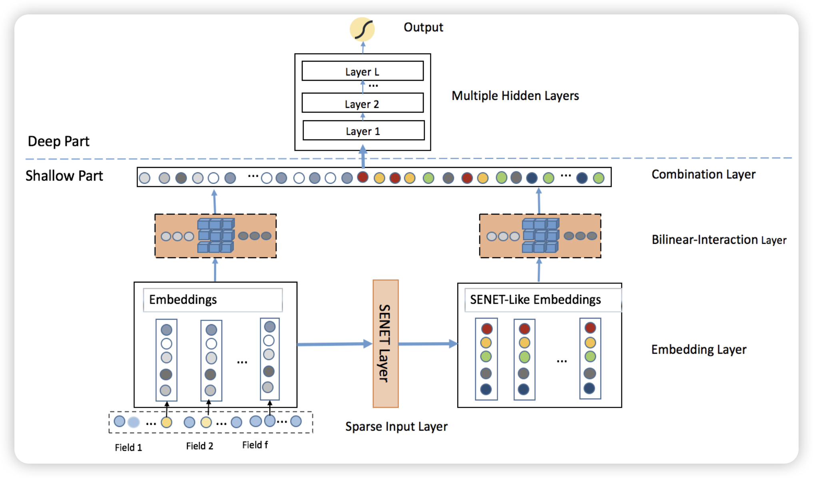

# FiBiNET: Combining Feature Importance and Bilinear feature Interaction for Click-Through Rate Prediction

公司：新浪

## 模型结构

核心：

- 双线性交叉：对每一对特征嵌入分配一个权重矩阵，先对其中之一进行线性变化，编码特征嵌入每个值之间的相关性，然后与另一个特征嵌入进行逐元素乘积，构建特征间的相关性。
- SENet：对特征嵌入维度进行池化，然后通过线性层压缩特征间的信息，转化为权重，对每个特征进行加权。
