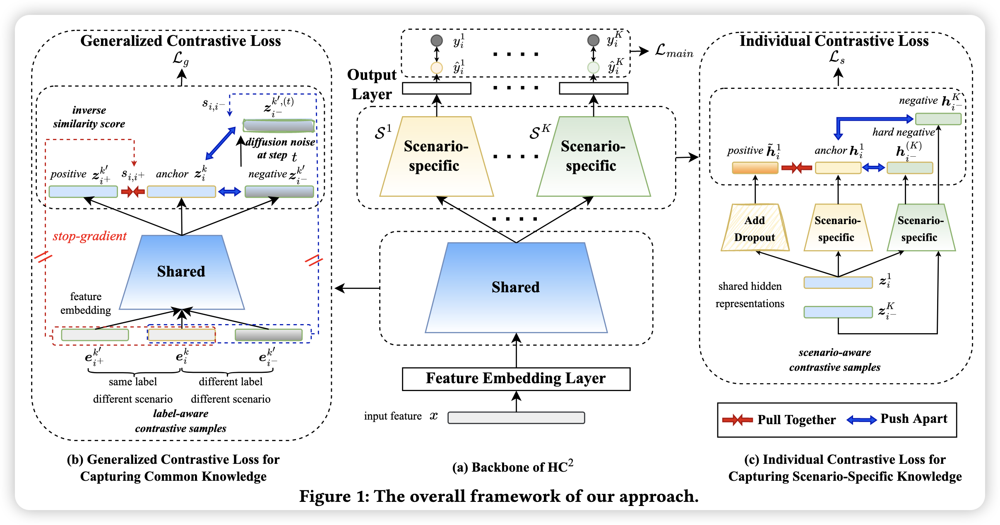

# Hybrid Contrastive Constraints for Multi-Scenario Ad Ranking

公司：阿里巴巴

关键词：对比学习、扩散

## 模型结构

对比损失函数中温度系数的作用？

温度系数绝对了对比损失对困难负样本的关注程度。越大的温度系数，往往一视同仁，不太会关注更困难的负样本；而温度系数越小，则越关注于该样本相似度非常大的困难负样本，给于困难负样本更大的梯度于正样本分离。
