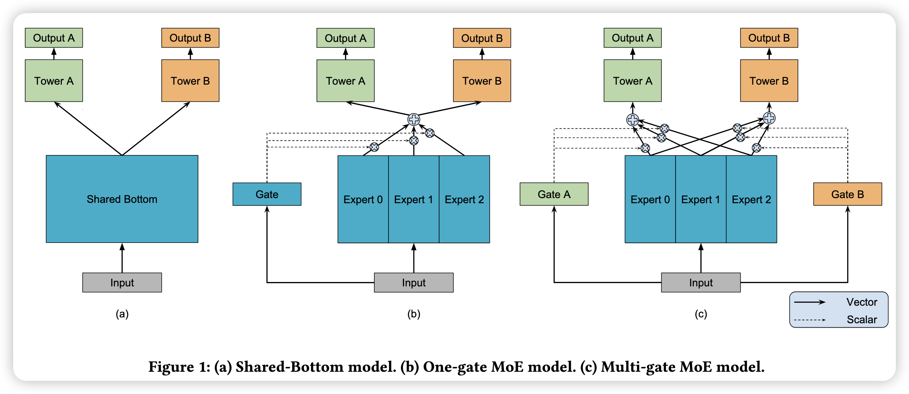

# Modeling Task Relationships in Multi-task Learning with Multi-gate Mixture-of-Experts

## 模型结构

## 公式

原始的MOE模型，有n个专家和一个门控单元

$$
y=\sum_{i=1}^{n}g(x)_i f_i(x),
$$

其中$g(x)_i=1$ 表示专家$f_i$的概率，且 $\sum_{i=1}^n g(x)_i=1$。

改进的MMOE模型

增加了多个门控，每个门控单元对多个专家进行不同的加权，用于学习不同的任务。

假设有$k$个任务，则有$k$个门控单元，每个门控单元$g^k$输出的n个权重与n个专家的输出向量进行加权求和，得到k个向量
$$
f^k(x)=\sum_{i=1}^n g^k(x)_i f_i(x).
$$

得到的k个向量再分别经过k个“塔”(一般是多个线性层)作为每个任务的输出
$$
y_k = h^k(f^k(x)).
$$