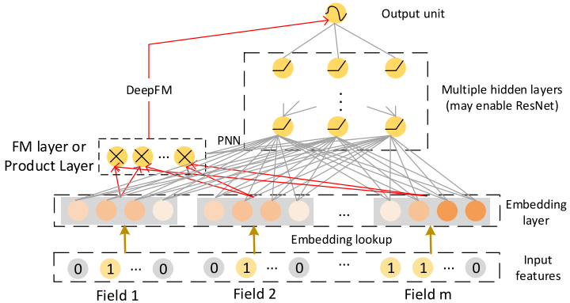
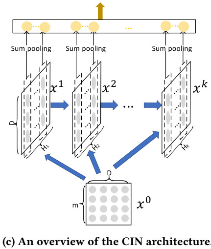
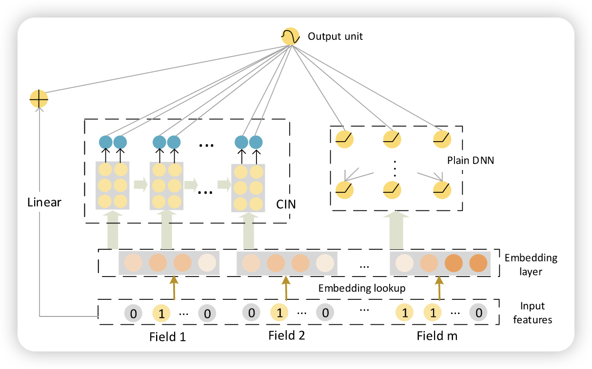

# xDeepFM: Combining Explicit and Implicit Feature Interactions for Recommender Systems

https://arxiv.org/pdf/1803.05170

## 研究背景

1. **研究问题**：这篇文章要解决的问题是组合特征在推荐系统中的重要性。传统的手动特征工程成本高且难以处理大规模数据集中的高维度稀疏特征。因此，研究如何自动学习特征交互以提升推荐系统的性能是一个重要的课题。
2. **研究难点**：该问题的研究难点包括：如何有效地学习高阶特征交互，如何在向量级别而非位级别上进行特征交互，以及如何在不需要手动特征工程的情况下自动学习特征交互。
3. **相关工作**：该问题的研究相关工作包括传统的因子分解机（FM）、基于深度学习的模型如FNN、PNN、Wide&Deep和DeepFM等。这些模型在不同程度上利用深度学习来学习高阶特征交互，但大多在隐式层面上进行交互，且存在参数过多和计算复杂度高的问题。

## 研究方法

这篇论文提出了一种新的压缩交互网络（Compressed Interaction Network, CIN）用于解决推荐系统中的高阶特征交互问题。具体来说，

1. **压缩交互网络（CIN）**：CIN旨在显式地学习高阶特征交互，并且交互是在向量级别上进行的。CIN的每一层通过外积操作计算特征之间的交互，并通过池化操作将高维特征映射到低维空间。其计算过程如下：

   $$
   X_{h,*}^k=\sum_{i=1}^{H_{k-1}}\sum_{j=1}^mW_{ij}^{k,h}(X_{i,*}^{k-1}\odot X_{j,*}^0)
   $$

   其中，$X^k$表示第$k$层的特征矩阵，$W^{k,h}$是权重矩阵，$\odot$表示Hadamard积。
    
    
2. 极端深度因子分解机（xDeepFM）：xDeepFM结合了CIN和传统的深度神经网络（DNN），以同时学习显式和隐式的高阶特征交互。其输出单元的计算公式如下：

$$
\hat{y}=\sigma(w_{\text{linear}}^T a + w_{\text{dnn}}^T x_{\text{dnn}}^k + w_{\text{cin}}^T p^+ + b)
$$
其中，$\sigma$是sigmoid函数，$a$是原始特征，$x_{\text{dnn}}^k$和$p^+$分别是DNN和CIN的输出，$w_*$和$b$是学习到的参数。

## 实验设计

1. **数据集**：实验在三个真实世界的数据集上进行，包括Criteo广告点击率预测数据集、Dianping餐厅推荐数据集和Bing新闻阅读服务数据集。
2. **评估指标**：使用AUC（ROC曲线下面积）和Logloss（交叉熵损失）两个指标来评估模型性能。AUC衡量正例排在负例前面的概率，而Logloss衡量预测分数与真实标签之间的距离。
3. **对比模型**：将xDeepFM与逻辑回归（LR）、传统的因子分解机（FM）、普通深度神经网络（DNN）、PNN、Wide&Deep、DCN和DeepFM等模型进行对比。
4. **实验设置**：使用TensorFlow3实现方法，通过网格搜索调整超参数，学习率设为0.001，优化方法使用Adam，mini-batch大小为4096，L2正则化参数为0.0001，DNN层数为2，CIN层数根据数据集不同分别为2和3。

## 结果与分析

1. **个体模型性能**：CIN在所有数据集上一致表现优于其他模型，表明显式学习高阶特征交互的有效性。例如，在Bing News数据集上，CIN需要5层才能达到最佳效果。

    

    

2. **集成模型性能**：xDeepFM在所有数据集上均表现最佳，证明了结合显式和隐式高阶特征交互的必要性和有效性。xDeepFM的最佳网络深度设置为3。

3. **超参数影响**：

    - **网络深度**：初始阶段，随着网络深度增加，xDeepFM性能提升，但当深度超过3时，性能下降，可能是由于过拟合。

    - **每层神经元数量**：在Bing News数据集上，增加神经元数量从20到200，性能稳步提升；在Dianping数据集上，100是更合适的设置。

    - 激活函数

        ：对于CIN中的神经元，恒等函数是最适合的激活函数。

        

## 总体结论

本文提出了一种新的压缩交互网络（CIN），能够显式地学习高阶特征交互，并在向量级别上进行交互。xDeepFM结合了CIN和DNN，能够同时学习显式和隐式的高阶特征交互，减少了手动特征工程的工作。实验结果表明，xDeepFM在三个真实世界数据集上均优于现有的最先进模型。未来的研究方向包括探索多值域的DIN机制和开发分布式版本的xDeepFM以提高训练效率。

# 论文评价

## 优点与创新

1. 提出了一种新的模型，名为Extreme Deep Factorization Machine（xDeepFM），能够有效地联合学习显式和隐式的高阶特征交互，无需手动特征工程。
2. 设计了一种压缩交互网络（CIN），能够在向量级别上显式学习高阶特征交互，并且随着网络深度的增加，特征交互的程度也在增加。
3. 通过将显式高阶交互模块与隐式交互模块以及传统的FM模块结合，xDeepFM能够自动学习高阶特征交互，减少了数据科学家在特征搜索上的工作量。
4. 在三个真实世界数据集上进行了广泛的实验，结果表明xDeepFM显著优于现有的最先进模型。
5. 提供了xDeepFM的源代码，方便其他研究者进行复现和验证。

## 不足与反思

1. 目前仅对多值字段使用了求和池化，未来可以探索使用DIN机制来根据候选项目捕捉相关的激活。
2. 由于CIN模块的时间复杂度较高，未来有兴趣开发xDeepFM的分布式版本，以便在GPU集群上高效训练。

# 关键问题及回答

**问题1：CIN模型是如何显式学习高阶特征交互的？**

CIN模型通过每一层的矩阵乘法操作来显式学习高阶特征交互。具体来说，CIN的每一层都是一个矩阵乘法操作，计算公式如下：

   $$
   X_{h,*}^k=\sum_{i=1}^{H_{k-1}}\sum_{j=1}^mW_{ij}^{k,h}(X_{i,*}^{k-1}\odot X_{j,*}^0)
   $$

其中，$X^k$表示第$k$层的特征矩阵，$W^{k,h}$是权重矩阵，$\odot$表示Hadamard积。通过这种方式，CIN能够在网络深度增加的同时，显式地学习高阶特征交互，并且交互的度数随网络深度的增加而增加。

**问题2：xDeepFM模型如何结合CIN和DNN的优势？**

xDeepFM模型通过将CIN和DNN结合，形成了一个端到端的模型，从而结合了显式和隐式高阶特征交互的优势。具体来说，xDeepFM的输出单元的计算公式如下：

$$
\hat{y}=\sigma(w_{\text{linear}}^T a + w_{\text{dnn}}^T x_{\text{dnn}}^k + w_{\text{cin}}^T p^+ + b)
$$
其中，$\sigma$是sigmoid函数，$a$是原始特征，$x_{\text{dnn}}^k$和$p^+$分别是DNN和CIN的输出，$w_*$和$b$是学习到的参数。xDeepFM既能显式地学习高阶特征交互（通过CIN），又能隐式地学习高阶特征交互（通过DNN），从而在推荐系统中实现了更好的性能。

**问题3：实验结果表明xDeepFM在不同数据集上的表现如何？**

xDeepFM在所有实验数据集上均表现出色，显著优于现有的最先进模型。具体来说：

- 在Criteo数据集上，xDeepFM的AUC达到了0.8052，Logloss为0.4418，最佳网络深度为3。
- 在Dianping数据集上，xDeepFM的AUC达到了0.8639，Logloss为0.3156，最佳网络深度为3。
- 在Bing News数据集上，xDeepFM的AUC达到了0.8400，Logloss为0.2649，最佳网络深度为3。
    这些结果表明，xDeepFM在处理稀疏特征和高阶特征交互方面具有显著优势，能够有效地提高推荐系统的性能。
### CIN

