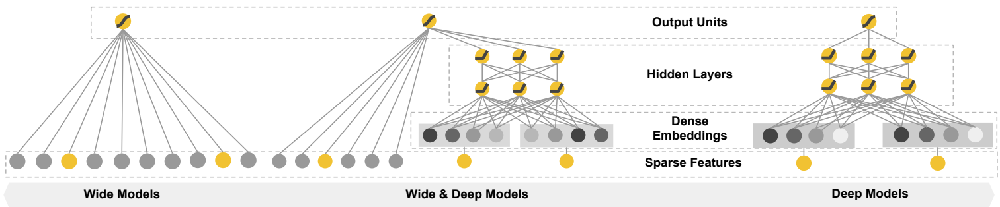
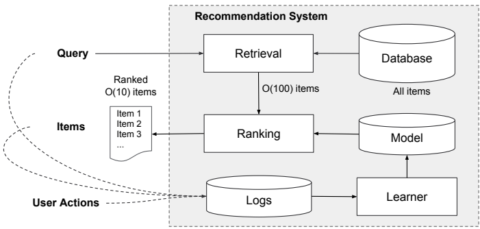
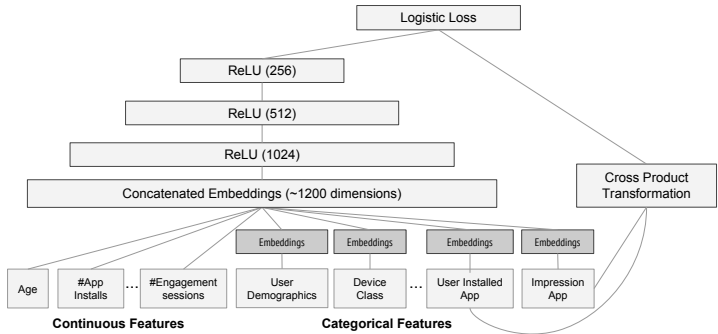
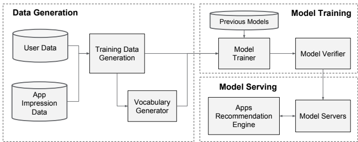

# Wide & Deep Learning for Recommender Systems

http://arxiv.org/abs/1606.07792

## 研究背景

1. **研究问题**：这篇文章要解决的问题是推荐系统中的记忆与泛化问题。具体来说，推荐系统需要在已知用户行为和历史数据的基础上，既要记住频繁出现的特征交互，又要泛化到新的特征组合，以提高推荐的多样性和准确性。
2. **研究难点**：该问题的研究难点包括：如何在稀疏输入和高秩矩阵的情况下，有效地学习低维密集嵌入向量；如何在不增加过多计算复杂度的情况下，同时实现记忆和泛化。
3. **相关工作**：该问题的研究相关工作有：广义线性模型（如逻辑回归）在处理大规模稀疏输入问题上的广泛应用；基于嵌入的模型（如因子分解机）通过学习低维嵌入向量来实现泛化；语言模型和计算机视觉中的联合训练方法。

## 研究方法

这篇论文提出了Wide&Deep学习框架，用于解决推荐系统中的记忆与泛化问题。具体来说，

1. **Wide组件**：Wide组件是一个广义线性模型，形式为 $y=w^T x+ b$ ，其中 $y$ 是预测值，$x$  是特征向量，$w$ 是模型参数，$b$ 是偏置项。特征集包括原始输入特征和经过变换的特征。最重要的变换是交叉乘积变换，定义为：
    $$
    \phi_k(x)=\prod_{i=1}^d x_{i}^{c_ki}
    $$
    其中 $c_{ki}\in \{0, 1\}$是一个布尔变量，如果第$i$个特征是第$k$个变换的一部分，则为1，否则为0。
2. **Deep组件**：Deep组件是一个前馈神经网络。对于分类特征，原始输入是特征字符串（如“language=en”）。每个稀疏的高维分类特征首先转换为低维稠密实值向量，通常维度在 $O(10)$ 到$O(100)$ 之间。嵌入向量初始化随机，然后在模型训练过程中通过最小化最终损失函数来训练。这些低维稠密嵌入向量随后被输入到神经网络的隐藏层中进行前向传播。具体计算如下：
    $$
    a^{(l+1)}=f(W^{(l)} a^{(l)} + b^{(l)})
    $$
    其中$l$ 是层号，$f$ 是激活函数（通常是ReLU），$a^{(l)}, b^{(l)}$和$W^{(l)}$分别是第$l$ 层的激活值、偏置和模型权重。

3. **联合训练**：Wide组件和Deep组件通过它们输出对数似然的加权和作为预测，然后输入到一个共同的逻辑损失函数中进行联合训练。联合训练通过使用小批量随机优化，同时从输出反向传播梯度到Wide和Deep组件的模型参数。实验中使用了Follow-the-regularized-leader (FTRL) 算法和AdaGrad优化器。

## 实验设计

实验在Google Play商店进行，这是一个拥有超过十亿活跃用户和一百多万款应用的商业化移动应用商店。实验设计包括以下几个阶段：

1. **数据生成**：使用一段时间内的用户和应用印象数据生成训练数据。每个样本对应一次印象，标签是应用获取：如果被印象的应用被安装，则标签为1，否则为0。还生成了词汇表，将分类特征字符串映射为整数ID。

2. **模型训练**：实验中使用的模型结构包括用户安装应用和印象应用的交叉乘积变换的Wide组件，以及每个分类特征学习32维嵌入向量的Deep组件。所有嵌入向量连接在一起，形成一个大约1200维的稠密向量，输入到3个ReLU层，最后通过逻辑输出单元。模型在超过5000亿个样本上进行训练，每次新数据到达时需要重新训练模型。

3. **模型服务**：模型训练和验证后，加载到模型服务器中。对于每个请求，服务器接收来自应用检索系统的应用候选集和用户特征，对每个应用进行评分，然后按分数从高到低排序展示给用户。为了在10毫秒内服务每个请求，实现了多线程并行处理，将每个批次分成更小的部分。

## 结果与分析

1. **应用获取**：进行了为期3周的在线实验，采用A/B测试框架。对照组中，1%的用户被展示由上一版本的排名模型生成的推荐，该模型是一个高度优化的仅Wide逻辑回归模型。实验组中，1%的用户被展示由Wide&Deep模型生成的推荐。结果表明，Wide&Deep模型比对照组和仅Deep模型分别提高了3.9%和1%的应用获取率（统计显著）。
2. **服务性能**：在峰值流量下，推荐服务器每秒评分超过一千万款应用。单线程情况下，一次性评分所有候选应用需要31毫秒。通过多线程和将每个批次分成更小的部分，显著将客户端延迟减少到14毫秒（包括服务开销）。

## 总体结论

本文提出的Wide&Deep学习框架结合了广义线性模型的记忆能力和深度神经网络的泛化能力，用于解决推荐系统中的记忆与泛化问题。通过在Google Play商店的实际应用和评估，证明了该框架能够显著提高应用获取率，并在高流量下保持高效的服务性能。

#  论文评价

## 优点与创新

1. **创新框架**：提出了Wide&Deep学习框架，通过联合训练线性模型组件和神经网络组件，结合了记忆化和泛化的优点。
2. **大规模实验**：在Google Play上进行大规模实验，验证了Wide&Deep模型在实际推荐系统中的有效性。
3. **开源实现**：开源了Wide&Deep的实现代码和高级API，促进了学术界和工业界的进一步研究和应用。
4. **显著提升**：在线实验结果显示，Wide&Deep模型相比单独的宽模型和深模型，显著提高了应用的获取率。
5. **多线程优化**：为了满足高吞吐量和低延迟的服务要求，实现了多线程并行处理，显著降低了客户端延迟。

## 不足与反思

1. **计算资源限制**：每次新数据到达都需要重新训练模型，计算开销大且延迟高。虽然实现了预热启动系统，但仍需进一步优化以提高效率。
2. **离线评估与在线评估的差异**：离线AUC略有提高，但在线流量影响更显著。可能的原因是离线数据集的印象和标签是固定的，而在线系统可以通过混合记忆化和泛化生成新的探索性推荐，并从新的用户响应中学习。

# 关键问题及回答

**问题1：Wide&Deep学习框架的Wide组件和Deep组件是如何具体实现的？它们在模型中各自承担什么功能？**

1. **Wide组件**：

- **实现**：Wide组件是一个广义线性模型，形式为 $y=w^T x+ b$ ，其中 $y$ 是预测值，$x$  是特征向量，$w$ 是模型参数，$b$ 是偏置项。

- **功能**：Wide组件的主要功能是通过交叉乘积变换来捕捉特征之间的交互关系，特别是那些频繁共现的特征对。交叉乘积变换的定义如下：
    $$
    \phi_k(x)=\prod_{i=1}^d x_{i}^{c_ki}
    $$

    其中 $c_{ki}\in \{0, 1\}$是一个布尔变量，如果第$i$个特征是第$k$个变换的一部分，则为1，否则为0。这种变换能够有效地记忆特征之间的关联。

1. **Deep组件**：

- **实现**：Deep组件是一个前馈神经网络，输入是稀疏的高维分类特征的字符串表示（如“language=en”），每个特征首先转换为低维稠密实值向量（嵌入向量），维度通常在 $O(10)$到 $O(100)$ 之间。嵌入向量在训练过程中被优化，最终通过神经网络的隐藏层传递。
- **功能**：Deep组件的主要功能是通过低维嵌入向量来捕捉特征之间的非线性关系，特别是那些在训练数据中较少出现或从未出现过的特征组合。这种嵌入表示能够增强模型的泛化能力。

**问题2：Wide&Deep模型在训练过程中是如何实现联合训练的？这种训练方式有哪些优势？**

1. **联合训练**：

- **实现**：Wide组件和Deep组件通过它们输出对数似然的加权和进行组合，然后输入到一个共同的逻辑损失函数中进行联合训练。具体来说，Wide组件的输出和Deep组件的输出通过一个加权和进行组合，公式如下：
    $$
    P(Y=1|x)=\sigma(w_{\text{wide}}^{T}[x, \phi(x)]+w_{\text{deep}}^{T}a^{l_f} + b)
    $$
    其中 $Y$ 是二分类标签，$\sigma$ 是sigmoid函数，$\phi(x)$ 是原始特征的交叉乘积变换，$a^{(l_f)}$是Deep组件的最终激活值，$w_{\text{wide}}$ 和  $w_{\text{deep}}$分别是Wide和Deep组件的权重，$b$ 是偏置项。

- **优势**：
- **参数优化**：联合训练可以同时优化Wide和Deep组件的所有参数，而不是分别训练。这样可以更好地平衡两者的优缺点，提高整体模型的性能。
- **模型容量**：通过联合训练，Wide组件可以用较少的特征和变换来补充Deep组件的弱点，而不需要完整的Wide模型，从而减少模型的大小和计算复杂度。
- **训练效率**：联合训练使用小批量随机优化，通过反向传播同时从输出到Wide和Deep部分传递梯度，可以更快地收敛。

**问题3：Wide&Deep模型在Google Play上的实验结果如何？这些结果说明了什么？**

1. **实验结果**：

- **应用获取率**：在A/B测试框架下进行了为期3周的现场实验，结果表明，Wide&Deep模型相比对照组（仅使用Wide模型）和仅使用Deep模型的模型，应用获取率分别提高了3.9%和1%（统计显著）。
- **服务性能**：在峰值流量下，推荐服务器每秒评分超过1000万个应用。通过多线程和将批次分成更小的批次，客户端延迟显著降低到14毫秒（包括服务开销）。

2. **说明**：

- **应用获取率的提升**：这些结果表明，Wide&Deep模型在应用获取方面显著优于仅使用Wide和仅使用Deep的模型，说明其结合记忆和泛化的能力在实际应用中非常有效。
- **服务性能的提升**：这些结果表明，Wide&Deep模型在高并发和低延迟的服务要求下表现出色，能够满足实际应用的需求。
- **实际应用的可行性**：通过在Google Play上的实际部署和评估，验证了Wide&Deep模型在大规模商业应用中的可行性和有效性。