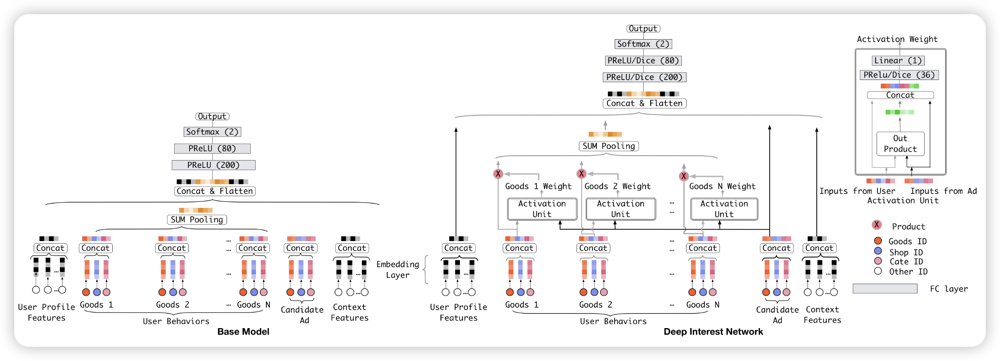

# Deep Interest Network for Click-Through Rate Prediction

公司：阿里巴巴

http://arxiv.org/abs/1706.06978

## 研究背景

1. **研究问题**：这篇文章要解决的问题是点击率（CTR）预测，这是在线广告等工业应用中的一个关键任务。CTR预测模型的准确性直接影响广告系统的最终收入。
2. **研究难点**：该问题的研究难点包括：如何有效捕捉用户的多样化兴趣，传统方法中使用固定长度向量表示用户兴趣存在表达能力不足的瓶颈，以及训练大规模稀疏特征深度网络的计算和存储开销。
3. **相关工作**：该问题的研究相关工作有：NNLM、LS-PLM、FM、Deep Crossing、Wide&Deep、YouTube Recommendation CTR Model、PNN、DeepFM等。这些方法大多遵循嵌入层（Embedding）和多层感知器（MLP）的结构，虽然在一定程度上减少了特征工程工作，但在表达用户多样化兴趣方面仍存在不足。

## 研究方法

这篇论文提出了一种新的模型——深度兴趣网络（DIN），用于解决CTR预测中的用户兴趣表达问题。具体来说，

1. **局部激活单元**：DIN通过引入局部激活单元，自适应地学习用户兴趣的表示。该单元通过对历史行为进行软搜索，关注与候选广告相关的部分行为，并通过加权和池化获得用户兴趣的表示。公式如下：

$$v_{U}(A) = f\left(v_{A}, e_{1}, e_{2}, \ldots, e_{H}\right) = \sum_{j=1}^{H} a\left(e_{j}, v_{A}\right) e_{j} = \sum_{j=1}^{H} w_{j} e_{j},$$

其中，$\{ e_{1}, e_{2}, \ldots, e_{H}\}$ 是用户U的行为嵌入向量列表，$v_U$是广告A的嵌入向量，$a(\cdot)$是一个前馈网络，输出为激活权重。

1. **小批量感知正则化**：为了应对大规模稀疏特征深度网络的训练挑战，本文提出了一种小批量感知正则化方法。该方法仅在每个小批量中出现的非零特征的参数参与L2范数的计算，从而减少计算量。公式如下：
   $$L_2(W) = \sum_{j=1}^K\sum_{m=1}^B\sum_{(x, y)\in\mathcal{B}_m}\frac{I\left(x_j
   \neq 0\right)}{n_j}\left\|w_j\right\|_2^2,$$
   其中，$w_j$ 是整个嵌入字典的参数，$I\left(x_j
   \neq 0\right)$ 表示实例x是否具有特征id $j$，$n_j$ 表示特征id $j$在所有样本中的出现次数。

2. **数据自适应激活函数**：为了更好地适应输入数据的分布，本文设计了一种名为Dice的数据自适应激活函数。Dice通过自适应调整截断点，控制两个通道之间的平滑切换。公式如下：
   $$f(s)=p(s)\cdot s + (1-ps(s)) \cdot \alpha s, p(s)=\frac{1}{1+e^{-\frac{s-E[s]}{\sqrt{Var[s] + \epsilon}}}}$$
   其中，$E[s]$ 和 $Var[s]$ 分别是每个小批量中输入的均值和方差。

## 实验设计

1. **数据集**：实验使用了三个数据集：Amazon Dataset、MovieLens Dataset和Alibaba Dataset。Amazon Dataset包含192,403名用户、63,001个商品、801个类别和1,689,188个样本。MovieLens Dataset包含138,493名用户、27,278部电影、21个类别和20,000,263个样本。Alibaba Dataset包含6亿用户和60亿个商品的特征，训练集包含两周的样本，测试集包含后一天的样本。
2. **实验设置**：对于所有模型，使用SGD作为优化器，学习率从1开始，衰减率为0.1，mini-batch大小为32。对于Alibaba Dataset，由于数据量巨大，mini-batch大小设置为5000，并使用Adam优化器，学习率从0.001开始，衰减率为0.9。
3. **评估指标**：主要使用AUC（Area Under the Curve）作为评估指标，AUC衡量了按预测CTR排序的广告的顺序质量。还引入了RelaImpr指标，用于衡量模型相对于基模型的相对改进。

## 结果与分析

1. **Amazon Dataset和MovieLens Dataset上的结果**：在Amazon Dataset和MovieLens Dataset上，所有深度学习模型均显著优于逻辑回归模型（LR）。DIN在所有竞争者中表现最佳，特别是在Amazon Dataset上，DIN显著提高了模型的表达能力。使用Dice激活函数的DIN进一步提升了性能。

   

   

2. **Alibaba Dataset上的结果**：在Alibaba Dataset上，DIN在所有深度模型中表现最佳，显著优于BaseModel、Wide&Deep、PNN和DeepFM。DIN的局部激活单元结构和提出的训练技术进一步提升了模型性能。使用小批量感知正则化和Dice激活函数的DIN总共实现了11.65%的RelaImpr和0.0113的绝对AUC增益。

3. **在线A/B测试结果**：在阿里巴巴的在线展示广告系统中进行的A/B测试显示，使用提出的正则化和激活函数的DIN相比基模型提升了10.0%的CTR和3.8%的RPM提升。

## 总体结论

本文提出了一种新的深度兴趣网络（DIN），通过引入局部激活单元和两种新技术（小批量感知正则化和数据自适应激活函数），显著提高了CTR预测模型的性能。DIN能够自适应地学习用户兴趣的表示，更好地捕捉用户的多样化兴趣。实验结果表明，DIN在多个数据集上均优于现有的最先进方法，并在阿里巴巴的实际生产环境中取得了显著的业务提升。

# 论文评价

## 优点与创新

1. **提出了一个新的模型：Deep Interest Network (DIN)**，通过设计局部激活单元来自适应地学习用户兴趣的表示，从而克服了传统Embedding&MLP方法中固定长度向量的局限性。
2. **开发了两种新技术**：mini-batch aware regularization和data adaptive activation function，这些技术有助于训练具有数亿参数的工业深度网络，并避免了过拟合问题。
3. **在多个数据集上的实验验证了所提方法的有效性**，包括在公共数据集和阿里巴巴的真实生产数据集上，DIN的表现优于现有的最先进方法。
4. **所提方法已被成功部署在阿里巴巴的在线展示广告系统中**，并显著提升了业务表现。
5. **提供了详细的实验设置和结果分析**，包括对比实验、AUC和RelaImpr等指标的计算和分析，展示了DIN在不同数据集上的表现。

## 不足与反思

1. **未来研究方向**：尽管论文尝试了LSTM来建模用户历史行为数据，但效果不佳。未来的研究可以探索专门的结构来顺序建模用户行为数据中的多重并发兴趣。

# 关键问题及回答

**问题1：深度兴趣网络（DIN）中的局部激活单元是如何设计的？它如何提高模型的表现？**

局部激活单元是DIN模型的核心组件之一。它的设计灵感来源于用户行为的局部激活特性。具体来说，局部激活单元通过对历史行为进行软搜索，关注与候选广告相关的部分行为，并通过加权求和池化获得用户兴趣的表示。公式如下：

$$
v_{U}(A) = f\left(v_{A}, e_{1}, e_{2}, \ldots, e_{H}\right) = \sum_{j=1}^{H} a\left(e_{j}, v_{A}\right) e_{j} = \sum_{j=1}^{H} w_{j} e_{j},
$$

其中，{e1,e2,…,eH}{*e*1,*e*2,…,*e**H*} 是用户U的行为嵌入向量列表，vA*v**A* 是广告A的嵌入向量，a(⋅)*a*(⋅) 是一个前馈网络，输出为激活权重。

这种设计的好处在于，它能够自适应地学习用户兴趣的表示，使得用户兴趣的表示向量在不同广告之间变化。这样不仅提高了模型的表达能力，还能更好地捕捉用户多样化的兴趣。实验结果表明，DIN模型在多个数据集上均优于现有的最先进方法，特别是在用户行为丰富的Amazon数据集上，表现尤为突出。

**问题2：小批量感知正则化（Mini-batch Aware Regularization）如何解决大规模稀疏特征网络训练中的过拟合问题？**

小批量感知正则化（Mini-batch Aware Regularization, MBA）是一种高效的正则化方法，专门用于解决大规模稀疏特征网络训练中的过拟合问题。传统的L2正则化方法需要在每次迭代中计算整个参数的L2范数，这在参数规模达到数亿时是不可行的。MBA方法通过仅在每个小批量中出现的非零特征的参数参与L2范数的计算，大大减少了计算量。公式如下：
   $$L_2(W) = \sum_{j=1}^K\sum_{m=1}^B\sum_{(x, y)\in\mathcal{B}_m}\frac{I\left(x_j
   \neq 0\right)}{n_j}\left\|w_j\right\|_2^2,$$

   其中，$w_j$ 是整个嵌入字典的参数，$I\left(x_j
   \neq 0\right)$ 表示实例x是否具有特征id $j$，$n_j$ 表示特征id $j$在所有样本中的出现次数。

通过这种方式，MBA方法在保证正则化效果的同时，显著减少了计算复杂度和内存消耗，使得大规模稀疏特征网络的训练变得可行。实验结果表明，MBA正则化在阿里巴巴数据集上表现最佳，能够有效防止过拟合，并显著提高模型的性能。

**问题3：数据自适应激活函数（Dice）与传统激活函数（如PReLU）相比有哪些优势？**

数据自适应激活函数（Dice）是一种改进的激活函数，旨在解决传统激活函数（如PReLU）在处理输入数据分布不一致时的不足。PReLU的硬整流点在输入值为0时固定为0，这可能不适用于输入数据分布各异的场景。Dice通过自适应调整整流点来适应输入数据的分布，公式如下：

   $$f(s)=p(s)\cdot s + (1-ps(s)) \cdot \alpha s, p(s)=\frac{1}{1+e^{-\frac{s-E[s]}{\sqrt{Var[s] + \epsilon}}}}$$

其中，$E[s]$ 和 $Var[s]$ 分别是每个小批量中输入的均值和方差。

Dice的优势在于：

1. **自适应整流点**：Dice根据输入数据的分布动态调整整流点，使得激活函数在不同输入范围内都能更好地发挥作用。
2. **平滑切换**：Dice在两个激活通道之间平滑切换，避免了PReLU在输入值为0时的硬切换。
3. **泛化能力**：Dice在训练过程中能够更好地适应不同分布的输入数据，从而提高模型的泛化能力和性能。

实验结果表明，使用Dice激活函数的DIN模型在多个数据集上均表现出色，特别是在处理大规模稀疏特征时，Dice能够显著提高模型的性能。

**问题 4：为什么计算权重时不使用 softmax?**

保留用户兴趣的比例。softmax是在指数空间计算的，会导致量纲变化。
